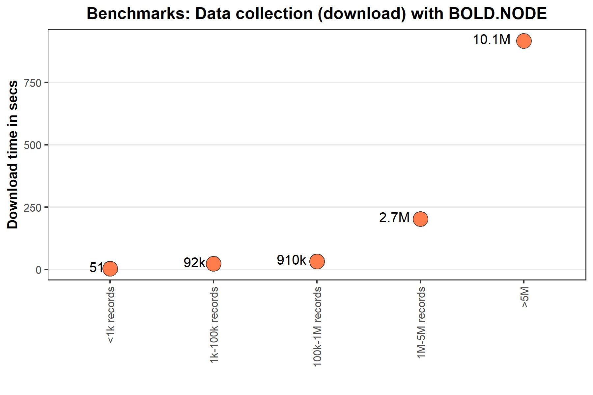

<!-- README.md is generated from README.Rmd. Please edit that file -->

# BOLD.NODE

**BOLD_NODE** is an R package that offers functionality to efficiently
explore BOLD dataset releases
(<https://boldsystems.org/data/data-packages/>) in the **Barcode Core
Data Model (BCDM)** format (for more information on BCDM please visit
its GitHub repo <https://github.com/boldsystems-central/BCDM>) locally.
It uses a **DuckDB** back end to query **parquet** files directly in R,
enabling fast searches even on systems with limited RAM. Data collection
is optimized through customized chunk sizes and configurable system
pause intervals.

The package also allows seamless conversion of search results into
standard R data structures without collecting the data in memory for
downstream analyses:

1.  **occurrence matrix** (biodiversity and ecology related analyses)
2.  **sf** (spatial data analyses)
3.  **DNAStringset** (phylogenetic data analyses)
4.  **fasta** (phylogenetic data analyses in third-party tools or in R)

<!-- badges: start -->

<!-- badges: end -->

## Downloading Data Packages

Users need to log into BOLD
(<https://bench.boldsystems.org/index.php/Login/page?destination=MAS_Management_UserConsole>)
to download the datasets.

## Installation

The package can be installed using `devtools::install_github` function
from the `devtools` package in R (which needs to be installed before)

``` r

devtools::install_github('https://github.com/sameerpadhye/BOLD.NODE.git')
```

## BOLD.NODE has 10 functions:

1.  bold.bcdm.fields
2.  bold.data.search
3.  bold.data.collect
4.  get.concise.summary
5.  *get.DNAStringset*
6.  get.DwC
7.  get.fasta
8.  get.occ.data
9.  get.sf
10. get.vocab

**Note** *Function 5*: *get.DNAStringset* requires the package
`Biostrings` to be installed and imported in the R session beforehand.
It can be installed using using `BiocManager` package.

``` r

# if (!requireNamespace("BiocManager", quietly=TRUE))
#   
# install.packages("BiocManager")
# 
# BiocManager::install("Biostrings")
```

## Workflow for search and collect (load the search into local memory)

A typical workflow for exploring and BOLD data (Steps in *italics* are
optional but useful in some instances):

1.  `bold.get.vocab` *(Provides unique terms present in a particular
    field, making it easier for exploring* `bold.data.search` *search
    parameters)*
2.  `bold.data.search` (Searches the dataset based on the user criteria
    and prints the number of records available)
3.  `bold.concise.summary` *(Provides a detailed summary of the dataset
    retrieved)*
4.  `bold.data.collect`(Collects the output of the `bold.data.search` in
    memory for downstream exploration/analyses).

### 1.Get the vocabulary for specific fields

``` r

# parquet_file<-'path where the parquet file from BOLD is downloaded'

# vocab.data <- bold.get.vocab(parquet_file,specific.cols = c("country/ocean"))
```

### 2.Search the dataset

``` r

# parquet_file<-'path where the parquet file from BOLD is downloaded'

#1 Taxonomy 

# bold_search_taxonomy <- bold.data.search(parquet_path=parquet_file,
# taxonomy = c("Odonata","Poecilia"))

#2 Geography

# bold_search_geography <- bold.data.search(parquet_path=parquet_file,
# taxonomy = c("Panthera pardus),
# geography = c("India"))

#3 Combination of many search criteria

# bold_search_combination <- bold.data.search(
# parquet_path=parquet_file,
# taxonomy = "Coleoptera",
# geography = "Canada",
# marker = "COI-5P",
# basecount = c(500, 660)
```

### 3.Data summary

``` r

# Get the concise summary

# bold_summary <- get.concise.summary(bold_search_geography)
```

### 4.Collect the searched data

``` r

# Collect data (no export)

# collected_data<-bold.data.collect(
# bold_search_geography,
# chunk.size = 50000,
# export = FALSE)

# Collect data (with parquet export)

# bold.data.collect(
# bold_search_combination,
# chunk.size = 50000,
# export = TRUE,
# export.type = "parquet",
# output.path = userdefinedpath)
```

### The `get.` functionality

The `get.` functions convert the search results from the
`bold.data.search` into objects used in packages such as `vegan`, `msa`,
`DECIPHER`, `terra`, `geodata` etc.

``` r

ggplot(benchmarks,
       aes(x=Category,
             y=median_time_collect))+
  geom_line(linewidth = 1.3, 
            color = "black") +
  geom_point(
    size = 5,
    pch = 21,
    fill = 'orangered',
    color = "black",
    alpha = 0.7
  ) +
  geom_text(aes(label = exact_records), vjust = 0.3, hjust = 1.35)+
  labs(
    x = "",
    y = "Download time in secs",
    title = "Benchmarks: Data collection (download) with BOLD.NODE") +
  theme_bw(base_size = 10) +
  theme(axis.text.x = element_text(angle = 90, vjust = 0.5, hjust = 1),
    panel.grid.minor = element_blank(),
    panel.grid.major.x = element_blank(),
    axis.title = element_text(face = "bold"),
    plot.title = element_text(face = "bold", hjust = 0.5)) 
#> `geom_line()`: Each group consists of only one observation.
#> ℹ Do you need to adjust the group aesthetic?
```


**Please note** Some queries (e.g., All “Diptera”) may return very large
datasets. Always check the summary before collecting data to ensure you
don’t exceed the available RAM.
